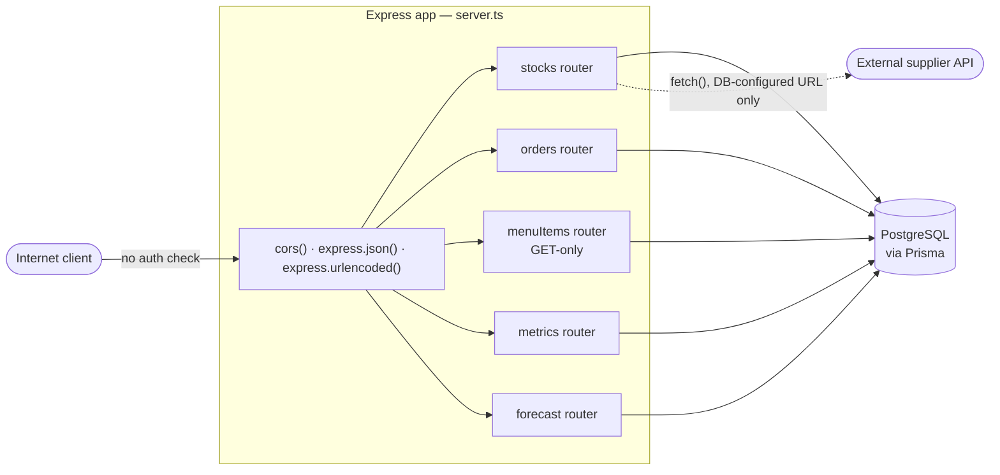

# Threat Model — Dine Flow `management_service`

**Target:** [`smart-kitchen-mgmt`](https://github.com/allaboutmike/smart-kitchen-mgmt), `management_service` backend (Express + TypeScript + Prisma + PostgreSQL)
**Scope:** Backend API only — frontend, `python_services`, and `supplier_api` are out of scope for this pass
**Method:** Manual review of `server.ts`, all five routers, and `schema.prisma` against STRIDE
**Status:** STRIDE analysis complete. Scan and tooling work against this codebase lives in the two lab writeups below, not duplicated here.

## Related labs

- [Lab 1 — Dependency, SAST, and secrets scans](./lab-1-dependency-and-code-scans.md) — first pass: ran SCA/SAST/secrets scans by hand once, triaged and fixed what needed fixing.
- [Lab 2 — CI pipeline and scanner verification](./lab-2-ci-pipeline.md) — second pass: wired those same scans into GitHub Actions, then verified the scanners themselves actually behave as expected instead of trusting a green checkmark.

## Context

Dine Flow was a 6-person cohort project (restaurant inventory/order management platform, ~04/2025–06/2025). I owned the `stocks` router and backend logic for stock/menu/order data access. This document is a retrospective security assessment I'm running against that codebase on my own initiative, as part of building AppSec/product security lab work — not a critique of the original team. Security wasn't the assignment; a working cohort project in a compressed timeframe was. That's exactly the kind of codebase this document exists to practice on.

## System overview

Every router is mounted through the same loop in `server.ts` with zero authentication middleware. Verified individually across all five router files — none define their own auth either. This is an app-wide structural gap, not something isolated to one endpoint.

## STRIDE analysis

| Category | Finding |
|---|---|
| **Spoofing** | Not applicable in the literal sense — no identity system exists, so there's nothing to spoof. Root cause is the same one driving most of this table: missing authentication ([OWASP API2:2023](https://owasp.org/API-Security/editions/2023/en/0xa2-broken-authentication/)). |
| **Tampering** | Any anonymous caller can `POST`/`PUT` to `stocks` and `orders` with no ownership check and no input validation beyond Prisma's column types. `orders.router.ts` `POST /` trusts the shape of `req.body.orderItems` fully. |
| **Repudiation** | No audit trail. `console.log` calls aren't persisted and don't capture caller identity. The schema has no `createdBy`/`userId` column anywhere (`expenses`, `stock`, `orders`) — retrofitting auth later still couldn't attribute past actions without a schema change. |
| **Information Disclosure** | Concrete, not just theoretical: `GET /api/metrics/Productivity` and `GET /api/metrics/waste` expose live profit, revenue, and best/worst-seller data with zero authentication. Separately, `cors()` with no options reflects any origin — a landmine for whenever session-based auth is added later. (Credit where due: error handlers return generic `"Internal server error"`, not stack traces.) |
| **Denial of Service** | No rate limiting anywhere. This is what made the dependency-level ReDoS CVEs (see [Dependency Remediation](https://github.com/Keelen-Carrera/smart-kitchen-mgmt/commit/8b8c310)) actually dangerous pre-fix — nothing throttled a malicious payload. It's a standing gap independent of those specific CVEs. |
| **Elevation of Privilege** | Not meaningfully applicable — there's no privilege tiering to elevate out of. This is downstream of the missing-auth problem, not a separate issue. |

## Checked and ruled out

Worth stating explicitly rather than leaving silent: `orders.router.ts` and `metrics.router.ts` both run raw SQL through `Db.$queryRaw` / `tx.$queryRaw` with template-literal interpolation — the pattern that causes SQL injection when done with plain string concatenation. Prisma's tagged-template `$queryRaw` parameterizes interpolated values automatically, so this is **not** injectable as written. Confirmed by reading the actual calls, not assumed from the library's reputation.

## The headline finding

The dependency vulnerabilities patched in [this commit](https://github.com/Keelen-Carrera/smart-kitchen-mgmt/commit/8b8c310) were real and worth fixing. But missing authentication isn't just another item on the same list — it's a multiplier. Because no auth barrier exists, *every* vulnerability in this app, including the ones already patched, was directly internet-reachable by anyone, with nothing reducing who could attempt to trigger them. Ranked by blast radius (full read/write access to business data plus live financial metrics — all three CIA legs) against attacker effort (zero — no credentials needed at all), broken access control ([OWASP A01:2021](https://owasp.org/Top10/A01_2021-Broken_Access_Control/)) is the finding that should lead any summary of this codebase's security posture, not the CVE count.

## Open items

- **Missing authentication/authorization** — the headline finding above. Out of scope to fix in these two labs (picking and implementing an auth strategy is a real design decision, not a quick patch); tracked here as the clear next lab.
- **Rate limiting** — absent app-wide; recommended regardless of whether/how auth gets added.
- **CORS** — needs explicit origin allowlisting once auth exists; not urgent before that.
- **Outbound `fetch()` to supplier APIs** (`stock.router.ts`) — URL is read from the database, and no endpoint in this codebase currently lets a caller set it, so this isn't attacker-reachable SSRF today. Worth re-checking if a suppliers-management endpoint is ever added.